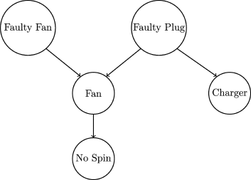

In my office, there is an electric fan that I use often in summer and not in other seasons. Imagine a scenario that I try to switch on the fan, but it does not spin. The fan is plugged into an extension socket or plug, and there is a possibility of a plug failure. How do we figure out what the possible causes are?

The fan has a probability of 0.02 for failure, whereas the plug is very old and has the failure probability *0.2*. I also have a mobile phone charger connected to the same plug. I found that the charger works well. What is the probability of the problem caused by a faulty fan?

We can represent this scenario as a simple Bayesian network, shown in Fig. 2.3

the parents of the random variable Fan are the nodes Faulty Fan and Faulty Plug, whereas the child of Fan is No Spin. The two variables Faulty Fan and Faulty Plug are marginally independent; however, they become conditionally dependent, given Fan.

references
https://www.sciencedirect.com/topics/mathematics/bayesian-network
