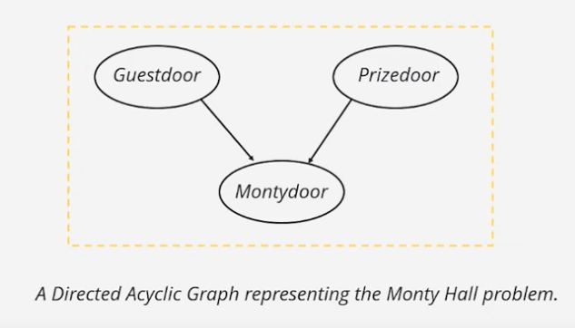

Problem Statement - Moty Hall Problem

Suppose you are on a game show, and you are given the chouce of three doors: Behind one door is a car, behind the other, goats. You pick a door, say No. 1, and the host, who knows what's beghind the doors, opens another door, say No. 3, which has a goat. He then says to you, "Do you want to pick door No. 2 ?" Is it to your advantage to swictch your choice?

How to model this problem using DAG?
Soln: Create a DAG with the following nodes:

1: Guest Door: Door chosen by guest
2: Prize: Door containing the prize
3: Monty: Door chosen by Monty

